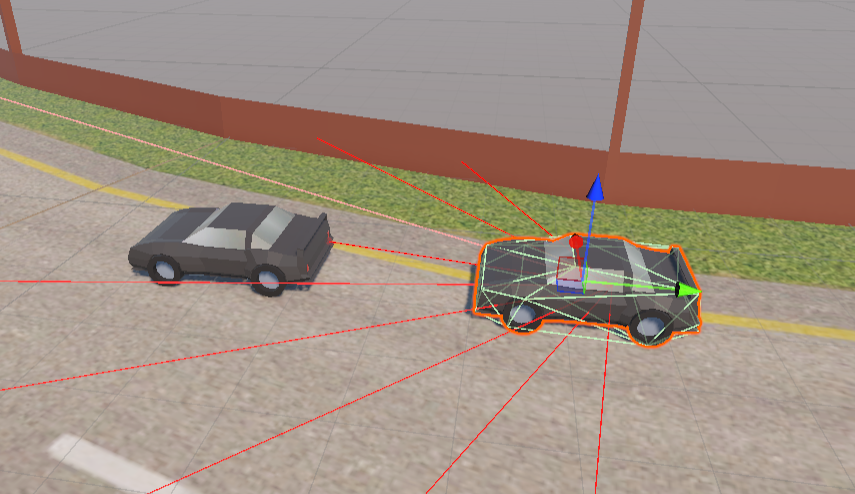
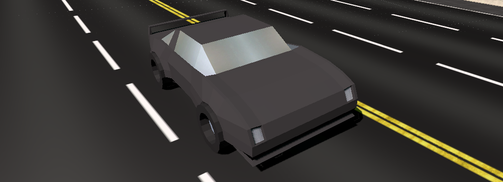
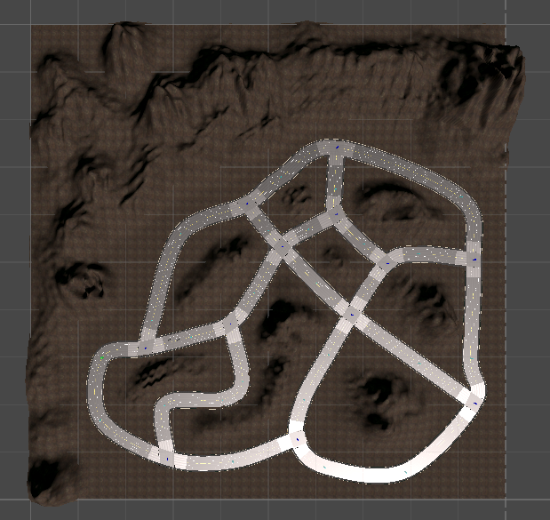

# Autonomous Vehicle Simulation Using Reinforcement Learning

Unity-based autonomous vehicle simulation that uses ML-Agents (PPO) for control and a Python/OpenCV lane-detection server for additional lane-confidence reward shaping.

## Features
- Unity ML-Agents PPO training setup
- RayPerception sensor (LiDAR-like) + camera lane detection
- TCP socket integration with a Python lane-detection server
- Road network built with the RoadArchitect package

## Screenshots
RayPerception sensor working:


Model car:


Environment (road, mountains, crosswalks):


## Requirements
- Unity **6000.0.37f1** (see `ProjectSettings/ProjectVersion.txt`)
- Python **3.8+**
- Python packages: `opencv-python`, `numpy`
- ML-Agents Python package that matches Unity package **com.unity.ml-agents 3.0.0**

## Quick Start (Simulation)
1. Install Python deps:
   ```powershell
   python -m pip install -r python\requirements.txt
   ```
2. Start the lane-detection server:
   ```powershell
   python python\lane.py
   ```
3. Open the project in Unity and load `Assets/Scenes/SampleScene.unity`.
4. Press Play. The agent should connect to the server at `127.0.0.1:5555`.

## Training (Optional)
1. Install the ML-Agents Python package that matches the Unity package version.
2. Run training from the project root:
   ```powershell
   mlagents-learn behaviors.yaml --run-id=AVRL --time-scale=20
   ```
3. Press Play in Unity to start training.
=======
Obstacle Avoidance: These sensors provide the RL agent with high-fidelity vector observations regarding the proximity of track barriers, other vehicles, and road boundaries.


## Repo Structure
- `Assets/` — Unity project assets and scripts
- `ProjectSettings/` — Unity project settings
- `Packages/` — Unity packages (includes ML-Agents 3.0.0)
- `python/` — Lane-detection server and dependencies
- `behaviors.yaml` — ML-Agents trainer configuration

<<<<<<< HEAD
## Notes
- Lane-detection debug images are saved in `python/output/` and are git-ignored.
- The lane server expects PNG bytes preceded by a 4-byte big-endian size and replies with a message + big-endian float confidence.
- If you change the server host/port, update `Assets/NNTrack.cs` to match.
=======
A dedicated camera sensor mounted on the vehicle captures the front-facing road view, which is processed via a dedicated Python server to ensure the vehicle remains centered.

Real-Time Processing: The raw frames are streamed via sockets to a Python environment where OpenCV-based algorithms detect lane markings.

Feedback Loop: The vision system outputs a confidence score that informs the RL agent’s steering decisions, mimicking human-like visual navigation.


## Technical Architecture

1. The Perception Pipeline

To handle complex image processing without slowing down the simulation physics, the camera data is sent to a Python server:

Preprocessing: Grayscale conversion and Gaussian Blur to reduce noise.

Canny Edge Detection: Isolating road markings.

Region of Interest (ROI): Masking unnecessary data (like the sky or dashboard).

Hough Line Transform: Extracting the mathematical coordinates of lane lines.

Confidence Score: Calculating the vehicle's alignment relative to the lane center.

2. Reinforcement Learning (PPO)

The agent is trained using Proximal Policy Optimization, chosen for its stability and efficiency.

Reward Function Structure:

- Positive Reward: Maintaining center lane alignment and target velocity.

- Negative Penalty: Colliding with barriers, leaving the road, or remaining stationary (to prevent "safe" but useless behavior).

##  Methodology & Tools

Simulation Engine: Unity (v2021.3 LTS)

RL Framework: Unity ML-Agents

Language: C# (Environment Control) & Python (AI & CV)

Computer Vision: OpenCV

Road Design: RoadArchitec


